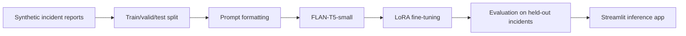

# LLM Severidade de Incidentes

## PT-BR

Projeto de **fine-tuning leve de LLM** para classificar a severidade de incidentes operacionais em três classes:

- `critical`
- `high`
- `normal`

O objetivo é simular um cenário de triagem de incidentes, em que o texto do relato precisa ser convertido em uma decisão operacional rápida sobre prioridade e impacto.

### O que foi usado

- modelo base: `google/flan-t5-small`
- técnica de adaptação: `LoRA`
- biblioteca de serving e treino: `transformers`
- adaptação eficiente: `peft`
- dataset: base **sintética controlada** de incidentes operacionais

### O que este projeto demonstra

Este repositório mostra um caso de **treino real de LLM**, não apenas uso de API com prompt. O modelo base foi adaptado com `LoRA` para internalizar o padrão de classificação de severidade a partir de relatos operacionais.

Em termos práticos, isso significa:

- o modelo recebe um relato textual de incidente;
- converte esse relato em uma decisão entre `critical`, `high` e `normal`;
- aprende essa tarefa por treino supervisionado;
- depois pode ser servido em interface para inferência.

### Por que este projeto é relevante

Ele demonstra um caso em que o modelo não está apenas sendo usado via prompt, mas **adaptado por treino** para internalizar um padrão de classificação de severidade.

### Pipeline



### Como o dataset foi construído

A base usada no projeto é sintética, mas controlada e reproduzível. Ela foi criada para simular cenários típicos de operação e suporte, com:

- sistemas afetados
- local da ocorrência
- sintoma observado
- impacto no negócio
- sinal de urgência

Cada exemplo recebe um rótulo de severidade:

- `critical`
  quando há indisponibilidade ampla, risco regulatório ou interrupção total
- `high`
  quando há degradação importante, atraso relevante ou workaround operacional
- `normal`
  quando o impacto é localizado, reversível ou de baixa urgência

### Técnicas usadas

- geração de dados sintéticos com regras semânticas controladas
- `instruction formatting` para transformar classificação em tarefa text-to-text
- fine-tuning eficiente com `LoRA`
- treino supervisionado com `Seq2SeqTrainer`
- avaliação em conjunto de teste separado
- serving local do adaptador treinado

### Resultados atuais

- `960` incidentes sintéticos
- `672` exemplos de treino
- `144` exemplos de validação
- `144` exemplos de teste
- modelo base: `google/flan-t5-small`
- `Accuracy = 0.6833`
- `Macro F1 = 0.6374`
- `Weighted F1 = 0.6400`

### Interpretação dos resultados

Para um fine-tuning leve, com dataset sintético pequeno e apenas `360` exemplos usados no treino efetivo desta versão, o resultado mostra que o modelo já aprendeu uma parte importante do padrão de severidade.

Esse número não pretende competir com benchmarks gigantes; o valor do projeto está em mostrar:

- adaptação real de um LLM
- pipeline de treino reproduzível
- avaliação objetiva
- inferência pronta para demonstração

### Estrutura

- [main.py](/Users/flaviagaia/Documents/CV_FLAVIA_CODEX/LLM-severidade-de-incidentes/main.py)
- [app.py](/Users/flaviagaia/Documents/CV_FLAVIA_CODEX/LLM-severidade-de-incidentes/app.py)
- [src/data_generation.py](/Users/flaviagaia/Documents/CV_FLAVIA_CODEX/LLM-severidade-de-incidentes/src/data_generation.py)
- [src/training.py](/Users/flaviagaia/Documents/CV_FLAVIA_CODEX/LLM-severidade-de-incidentes/src/training.py)
- [src/inference.py](/Users/flaviagaia/Documents/CV_FLAVIA_CODEX/LLM-severidade-de-incidentes/src/inference.py)

### Artefatos gerados

- `data/raw/incident_severity_synthetic.csv`
- `data/processed/train.csv`
- `data/processed/valid.csv`
- `data/processed/test.csv`
- `data/processed/metrics.json`
- `data/processed/test_predictions.csv`
- `artifacts/severity_llm_lora/`

### Interface

O `Streamlit` permite:

- treinar/atualizar o adaptador
- testar um novo incidente manualmente
- visualizar amostras previstas no conjunto de teste
- inspecionar métricas da versão treinada

### Como executar

```bash
python3 -m venv .venv
source .venv/bin/activate
pip install -r requirements.txt
python3 main.py
streamlit run app.py
```

---

## EN

Lightweight **LLM fine-tuning** project for classifying operational incident severity into:

- `critical`
- `high`
- `normal`

It simulates a triage workflow where a narrative incident report must be converted into a severity decision for operations.

### Stack

- base model: `google/flan-t5-small`
- adaptation method: `LoRA`
- training/inference framework: `transformers`
- efficient tuning layer: `peft`
- dataset: controlled **synthetic incident reports**

### What this project proves

This repository demonstrates **real LLM training**, not just API prompting. The base model is adapted with `LoRA` so that the severity classification pattern becomes part of the model behavior.

### Current results

- `960` synthetic incidents
- `672` training rows
- `144` validation rows
- `144` test rows
- base model: `google/flan-t5-small`
- `Accuracy = 0.6833`
- `Macro F1 = 0.6374`
- `Weighted F1 = 0.6400`

### Why this project matters

This repository shows a practical scenario where an LLM is not only prompted, but actually **adapted through training** to learn a severity classification behavior.

In practical terms:

- the model reads an incident narrative;
- maps it to `critical`, `high`, or `normal`;
- learns this pattern through supervised fine-tuning;
- and can then be served in an interactive app.

### How the dataset was built

The dataset is synthetic, but controlled and reproducible. It was designed to simulate operational and support incidents with:

- affected systems
- occurrence location
- observed symptom
- business impact
- urgency signal

Each sample receives a severity label:

- `critical`
  when there is broad unavailability, regulatory exposure, or full interruption
- `high`
  when there is major degradation, relevant delay, or operational workaround
- `normal`
  when the impact is localized, reversible, or low urgency

### Techniques used

- synthetic data generation with controlled semantic rules
- `instruction formatting` to cast classification as a text-to-text task
- efficient fine-tuning with `LoRA`
- supervised training with `Seq2SeqTrainer`
- held-out evaluation on test data
- local serving of the trained adapter

### Interpretation of the results

For a lightweight fine-tuning setup, with a relatively small synthetic dataset and a compact base model, the result shows that the model learns a meaningful share of the severity pattern.

The goal here is not to beat large-scale benchmarks, but to demonstrate:

- real LLM adaptation
- a reproducible training pipeline
- objective evaluation
- inference-ready artifacts

### Generated artifacts

- `data/raw/incident_severity_synthetic.csv`
- `data/processed/train.csv`
- `data/processed/valid.csv`
- `data/processed/test.csv`
- `data/processed/metrics.json`
- `data/processed/test_predictions.csv`
- `artifacts/severity_llm_lora/`

### Interface

The `Streamlit` app allows you to:

- retrain/update the adapter
- test a new incident manually
- inspect predicted samples from the test set
- review the current trained metrics
