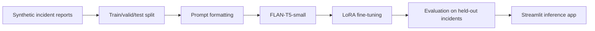

# LLM Severidade de Incidentes

## PT-BR

Projeto de **fine-tuning leve de LLM** para classificar a severidade de incidentes operacionais em três classes:

- `critical`
- `high`
- `normal`

O objetivo é simular um cenário de triagem de incidentes, em que o texto do relato precisa ser convertido em uma decisão operacional rápida sobre prioridade e impacto.

### Problema que o projeto resolve

Em ambientes operacionais, times de suporte, SRE, observabilidade e gestão de incidentes precisam responder rapidamente perguntas como:

- este evento deve abrir ponte de crise?
- o impacto descrito já configura severidade crítica?
- o relato exige escalonamento imediato ou pode seguir fluxo normal?

Na prática, isso significa transformar texto não estruturado em uma decisão de priorização. Este projeto reproduz exatamente esse tipo de problema: **classificar severidade a partir de um relato narrativo de incidente**.

### O que foi usado

- modelo base: `google/flan-t5-small`
- técnica de adaptação: `LoRA`
- biblioteca de serving e treino: `transformers`
- adaptação eficiente: `peft`
- dataset: base **sintética controlada** de incidentes operacionais

### Por que usar LoRA neste caso

Este projeto foi desenhado para mostrar **fine-tuning real de LLM com custo computacional controlado**. Em vez de atualizar todos os pesos do modelo base, a adaptação é feita com `LoRA`, o que reduz:

- memória necessária para treino
- custo computacional
- tamanho dos artefatos finais
- complexidade de distribuição do modelo ajustado

Isso torna o projeto mais próximo de um fluxo prático de adaptação leve de modelos em ambiente de time de dados ou IA aplicada.

### O que este projeto demonstra

Este repositório mostra um caso de **treino real de LLM**, não apenas uso de API com prompt. O modelo base foi adaptado com `LoRA` para internalizar o padrão de classificação de severidade a partir de relatos operacionais.

Em termos práticos, isso significa:

- o modelo recebe um relato textual de incidente;
- converte esse relato em uma decisão entre `critical`, `high` e `normal`;
- aprende essa tarefa por treino supervisionado;
- depois pode ser servido em interface para inferência.

### Por que este projeto é relevante

Ele demonstra um caso em que o modelo não está apenas sendo usado via prompt, mas **adaptado por treino** para internalizar um padrão de classificação de severidade.

### Pipeline



### Arquitetura técnica do pipeline

1. `Data generation`
   Gera incidentes sintéticos com combinações controladas de sistema afetado, local, sintoma, impacto e sinal de urgência.
2. `Dataset split`
   Divide a base em treino, validação e teste.
3. `Instruction formatting`
   Reescreve o problema como tarefa `text-to-text` para o `FLAN-T5`.
4. `LoRA fine-tuning`
   Ajusta apenas componentes de baixo rank nas projeções de atenção.
5. `Held-out evaluation`
   Mede `accuracy`, `macro F1` e `weighted F1`.
6. `Inference app`
   Carrega o adaptador salvo e permite inferência interativa via `Streamlit`.

### Como o dataset foi construído

A base usada no projeto é sintética, mas controlada e reproduzível. Ela foi criada para simular cenários típicos de operação e suporte, com:

- sistemas afetados
- local da ocorrência
- sintoma observado
- impacto no negócio
- sinal de urgência

Cada exemplo recebe um rótulo de severidade:

- `critical`
  quando há indisponibilidade ampla, risco regulatório ou interrupção total
- `high`
  quando há degradação importante, atraso relevante ou workaround operacional
- `normal`
  quando o impacto é localizado, reversível ou de baixa urgência

### Estrutura semântica dos exemplos

Cada incidente é composto por um template textual com 5 blocos principais:

- `system`
  qual serviço ou plataforma foi afetado
- `location`
  onde ocorreu a falha
- `symptom`
  qual comportamento anômalo foi observado
- `impact`
  consequência operacional ou de negócio
- `signal`
  indício adicional de urgência, escalonamento ou exposição

Essa estrutura foi escolhida para dar ao modelo pistas semânticas que lembram incidentes reais, sem depender de dados sensíveis.

### Técnicas usadas

- geração de dados sintéticos com regras semânticas controladas
- `instruction formatting` para transformar classificação em tarefa text-to-text
- fine-tuning eficiente com `LoRA`
- treino supervisionado com `Seq2SeqTrainer`
- avaliação em conjunto de teste separado
- serving local do adaptador treinado

### Formulação da tarefa para o LLM

O projeto usa o modelo base `FLAN-T5-small`, que segue o paradigma `seq2seq`. Em vez de treinar um classificador com cabeça linear tradicional, a tarefa é formulada como instrução:

```text
Classify the severity of the incident report into one of: critical, high, normal.
Incident: <incident_text>
Answer:
```

O modelo aprende então a gerar diretamente o rótulo textual da classe.

### Matemática por trás do LoRA

No fine-tuning tradicional, uma matriz de pesos `W` seria totalmente atualizada. No `LoRA`, a atualização é aproximada por:

`W' = W + ΔW`

com:

`ΔW = A x B`

onde `A` e `B` são matrizes de baixo rank. Isso permite aprender uma adaptação expressiva com muito menos parâmetros treináveis do que atualizar a matriz inteira.

No projeto, essa adaptação é aplicada em módulos de atenção do modelo `seq2seq`, preservando o backbone original e treinando apenas os componentes adicionados.

### Configuração de treino

Principais escolhas da versão atual:

- modelo base: `google/flan-t5-small`
- épocas: `4`
- `learning_rate = 5e-4`
- `batch_size = 4`
- tamanho efetivo de treino usado nesta execução: `360` exemplos
- avaliação em conjunto separado
- geração final feita em CPU para maior compatibilidade no ambiente local

### Métricas usadas

- `Accuracy`
  percentual total de previsões corretas
- `Macro F1`
  média do F1 entre classes, importante para não favorecer a classe dominante
- `Weighted F1`
  F1 ponderado pelo suporte de cada classe

### Resultados atuais

- `960` incidentes sintéticos
- `672` exemplos de treino
- `144` exemplos de validação
- `144` exemplos de teste
- modelo base: `google/flan-t5-small`
- `Accuracy = 0.6833`
- `Macro F1 = 0.6374`
- `Weighted F1 = 0.6400`

### Interpretação dos resultados

Para um fine-tuning leve, com dataset sintético pequeno e apenas `360` exemplos usados no treino efetivo desta versão, o resultado mostra que o modelo já aprendeu uma parte importante do padrão de severidade.

Esse número não pretende competir com benchmarks gigantes; o valor do projeto está em mostrar:

- adaptação real de um LLM
- pipeline de treino reproduzível
- avaliação objetiva
- inferência pronta para demonstração

### Limitações atuais

- a base é sintética, então não captura toda a ambiguidade de incidentes reais
- o modelo base é pequeno, o que limita sofisticação semântica
- o treino foi mantido leve para ser reproduzível localmente
- o projeto demonstra adaptação supervisionada, não uma solução final de produção

### Próximas evoluções possíveis

- ampliar o vocabulário de incidentes com templates mais ambíguos
- incluir classes adicionais como `low`, `medium`, `sev1`, `sev2`
- comparar `LoRA` com um baseline clássico de classificação
- adicionar explicação do motivo da severidade
- servir o modelo por API com `FastAPI`

### Estrutura

- [main.py](/Users/flaviagaia/Documents/CV_FLAVIA_CODEX/LLM-severidade-de-incidentes/main.py)
- [app.py](/Users/flaviagaia/Documents/CV_FLAVIA_CODEX/LLM-severidade-de-incidentes/app.py)
- [src/data_generation.py](/Users/flaviagaia/Documents/CV_FLAVIA_CODEX/LLM-severidade-de-incidentes/src/data_generation.py)
- [src/training.py](/Users/flaviagaia/Documents/CV_FLAVIA_CODEX/LLM-severidade-de-incidentes/src/training.py)
- [src/inference.py](/Users/flaviagaia/Documents/CV_FLAVIA_CODEX/LLM-severidade-de-incidentes/src/inference.py)
- [src/pipeline.py](/Users/flaviagaia/Documents/CV_FLAVIA_CODEX/LLM-severidade-de-incidentes/src/pipeline.py)
- [tests/test_pipeline.py](/Users/flaviagaia/Documents/CV_FLAVIA_CODEX/LLM-severidade-de-incidentes/tests/test_pipeline.py)

### Artefatos gerados

- `data/raw/incident_severity_synthetic.csv`
- `data/processed/train.csv`
- `data/processed/valid.csv`
- `data/processed/test.csv`
- `data/processed/metrics.json`
- `data/processed/test_predictions.csv`
- `artifacts/severity_llm_lora/`

### Interface

O `Streamlit` permite:

- treinar/atualizar o adaptador
- testar um novo incidente manualmente
- visualizar amostras previstas no conjunto de teste
- inspecionar métricas da versão treinada


### Como executar

```bash
python3 -m venv .venv
source .venv/bin/activate
pip install -r requirements.txt
python3 main.py
streamlit run app.py
```

---

## EN

Lightweight **LLM fine-tuning** project for classifying operational incident severity into:

- `critical`
- `high`
- `normal`

It simulates a triage workflow where a narrative incident report must be converted into a severity decision for operations.

### Business problem addressed

In operations and incident management environments, teams often need to answer questions such as:

- should this event trigger a crisis bridge?
- does the described impact already qualify as critical severity?
- should the case be escalated immediately or handled in a normal queue?

This project models exactly that type of problem: **severity classification from unstructured incident narratives**.

### Stack

- base model: `google/flan-t5-small`
- adaptation method: `LoRA`
- training/inference framework: `transformers`
- efficient tuning layer: `peft`
- dataset: controlled **synthetic incident reports**

### Why LoRA was chosen

This project is meant to demonstrate **real LLM adaptation with manageable compute cost**. Instead of updating all model weights, `LoRA` injects low-rank trainable adapters, which reduces:

- memory requirements
- training cost
- artifact size
- deployment complexity

### What this project proves

This repository demonstrates **real LLM training**, not just API prompting. The base model is adapted with `LoRA` so that the severity classification pattern becomes part of the model behavior.

### Technical pipeline architecture

1. `Data generation`
   Creates controlled synthetic incidents with system, location, symptom, impact, and urgency signal.
2. `Dataset split`
   Splits data into train, validation, and test sets.
3. `Instruction formatting`
   Casts the problem as a `text-to-text` task for `FLAN-T5`.
4. `LoRA fine-tuning`
   Updates only low-rank adapters inside the attention stack.
5. `Held-out evaluation`
   Measures `accuracy`, `macro F1`, and `weighted F1`.
6. `Inference app`
   Loads the saved adapter and exposes interactive inference through `Streamlit`.

### Current results

- `960` synthetic incidents
- `672` training rows
- `144` validation rows
- `144` test rows
- base model: `google/flan-t5-small`
- `Accuracy = 0.6833`
- `Macro F1 = 0.6374`
- `Weighted F1 = 0.6400`

### Dataset construction

The dataset is synthetic but controlled and reproducible. Each incident is built from five semantic blocks:

- affected system
- occurrence location
- observed symptom
- business impact
- urgency signal

This structure gives the model realistic semantic cues while avoiding the use of sensitive incident data.

### Why this project matters

This repository shows a practical scenario where an LLM is not only prompted, but actually **adapted through training** to learn a severity classification behavior.

In practical terms:

- the model reads an incident narrative;
- maps it to `critical`, `high`, or `normal`;
- learns this pattern through supervised fine-tuning;
- and can then be served in an interactive app.

### Task formulation for the LLM

The base model `FLAN-T5-small` follows a `seq2seq` paradigm. Instead of adding a classic classifier head, the task is formulated as an instruction:

```text
Classify the severity of the incident report into one of: critical, high, normal.
Incident: <incident_text>
Answer:
```

The model is trained to generate the textual class label directly.

### Mathematics behind LoRA

In full fine-tuning, a weight matrix `W` would be updated directly. In `LoRA`, the update is approximated as:

`W' = W + ΔW`

with:

`ΔW = A x B`

where `A` and `B` are low-rank trainable matrices. This allows the model to learn a meaningful adaptation while updating far fewer parameters than full fine-tuning.

### Training configuration

Main settings in the current version:

- base model: `google/flan-t5-small`
- epochs: `4`
- `learning_rate = 5e-4`
- `batch_size = 4`
- effective training subset in this run: `360` rows
- held-out evaluation
- final generation forced to CPU for local compatibility

### How the dataset was built

The dataset is synthetic, but controlled and reproducible. It was designed to simulate operational and support incidents with:

- affected systems
- occurrence location
- observed symptom
- business impact
- urgency signal

Each sample receives a severity label:

- `critical`
  when there is broad unavailability, regulatory exposure, or full interruption
- `high`
  when there is major degradation, relevant delay, or operational workaround
- `normal`
  when the impact is localized, reversible, or low urgency

### Techniques used

- synthetic data generation with controlled semantic rules
- `instruction formatting` to cast classification as a text-to-text task
- efficient fine-tuning with `LoRA`
- supervised training with `Seq2SeqTrainer`
- held-out evaluation on test data
- local serving of the trained adapter

### Metrics

- `Accuracy`
  overall proportion of correct predictions
- `Macro F1`
  average F1 across classes, useful for balanced judgment in multiclass settings
- `Weighted F1`
  F1 weighted by class support

### Interpretation of the results

For a lightweight fine-tuning setup, with a relatively small synthetic dataset and a compact base model, the result shows that the model learns a meaningful share of the severity pattern.

The goal here is not to beat large-scale benchmarks, but to demonstrate:

- real LLM adaptation
- a reproducible training pipeline
- objective evaluation
- inference-ready artifacts

### Current limitations

- the dataset is synthetic and therefore less ambiguous than real incident logs
- the base model is intentionally small
- the training setup is lightweight for local reproducibility
- this project demonstrates supervised adaptation, not a final production-ready severity platform

### Generated artifacts

- `data/raw/incident_severity_synthetic.csv`
- `data/processed/train.csv`
- `data/processed/valid.csv`
- `data/processed/test.csv`
- `data/processed/metrics.json`
- `data/processed/test_predictions.csv`
- `artifacts/severity_llm_lora/`

### Possible next steps

- add more ambiguous templates and broader vocabulary
- introduce more severity levels such as `low`, `medium`, `sev1`, `sev2`
- benchmark against a classic classifier baseline
- add rationale generation for severity explanation
- serve the adapted model through a `FastAPI` endpoint

### Interface

The `Streamlit` app allows you to:

- retrain/update the adapter
- test a new incident manually
- inspect predicted samples from the test set
- review the current trained metrics


